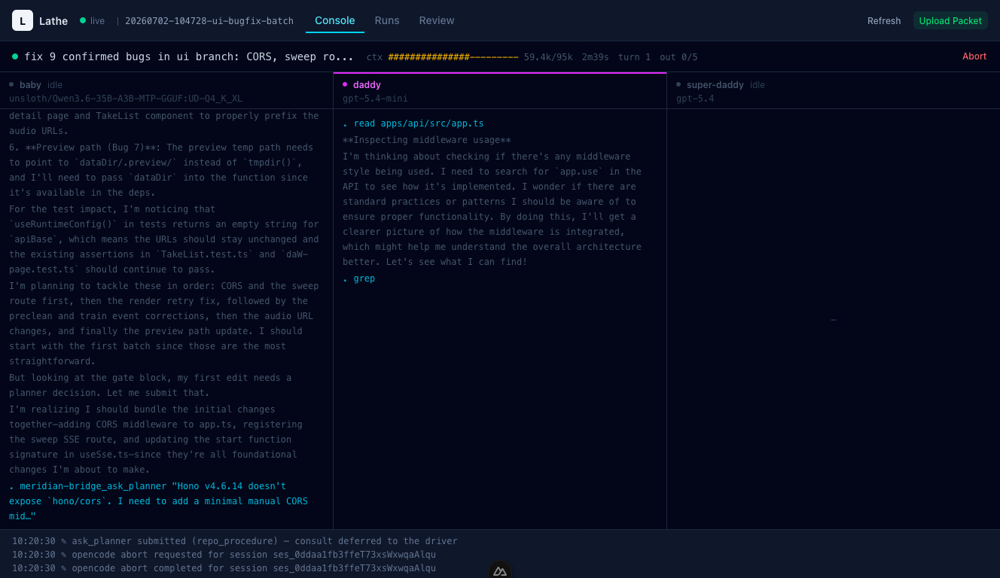

# lathe

Lathe is my local harness for running packet-designed implementation work through opencode overnight, with an Executor, Planner, Implementation Reviewer, Acceptance Reviewer, Human Operator, queue, journal, and live tail UI.

Lathe isn't just another opencode wrapper that pipes a prompt to a model and commits whatever comes back. Lathe splits the job: a small, fast local model, currently Qwen3.6-A3B, acts as Executor; a more powerful model, currently GPT 5.4 Mini, acts as Planner and Implementation Reviewer. The Planner answers scoped implementation questions, the Implementation Reviewer audits the completed run, and an expensive model (GPT, Claude, GLM) acts as Acceptance Reviewer over the cumulative work item before the Human Operator decides whether to merge it.

That reviewer loop is where the value is. It says the things a 3B-active model will not reliably say about its own output: this test encodes the wrong behaviour, this seam is not earned, this extraction is a pattern that appeared exactly once. The Executor writes the code; the review responsibilities supply the judgment.

## Status



This is a personal tool, not a polished public product. It is only tested on macOS.

The old project name was Meridian. Some paths and source identifiers still say `meridian`, most importantly the `~/.meridian/v3/` state root and the `meridian/` run-branch prefix. These are functional and renaming them would break existing state; the MCP bridge tool prefix (`meridian-bridge_*`) is also retained. Everything user-facing now says Lathe.

## Requirements

- Node.js 22+
- pnpm 11+
- opencode configured with the providers and agents you want lathe to use

## Build

```sh
pnpm install
pnpm build
```

The `lathe` CLI binary is `apps/lathe-cli/dist/index.js`. Rebuild after changing core or CLI source.

## Configure

Create or edit:

```text
~/.meridian/v3/config.json
```

The defaults live in `packages/core/src/config/schemas.ts`. The main knobs are:

- `opencode`: binary and port settings
- `baby`: legacy config key for the Executor provider, model, base URL, agent, turn budget, and promotion target
- `daddy`: legacy config key shared by the Planner and Implementation Reviewer provider, model, agent, and timeout
- `superdaddy`: legacy config key for the Acceptance Reviewer provider, model, agent, timeout, and review skill paths
- `thresholds`: rotation, checkpoint, verification, promotion, stall, and convergence limits
- `concurrency.maxWorkers`: how many queue workers the daemon runs in parallel; defaults to `1`
- `daemon`: HTTP/SSE host and port for the CLI and dashboard

## Authoring Packets

The repo-owned opencode skill for writing Lathe packets lives at:

```text
.opencode/skills/packet/SKILL.md
```

Use that skill when turning a design into an overnight packet. It documents the current packet rules, admission flow, the legacy `~/.meridian/v3` state root, and the expectation that packets are validated with `lathe queue add <packet.md>` rather than dropped into the queue by hand.

## Packet Shape

Packets are Markdown files with YAML frontmatter. Required fields are:

```yaml
---
repo: /path/to/repo
base: main
compare_commit: main
summary: Brief label shown in tail
outcomes:
  - id: useful-outcome
    description: What must be true when the run is done
expected_surface:
  - src/some/file.ts
verification:
  - command: npm run check
---

Write the implementation instructions here.
```

`compare_commit` is the fixed cumulative review baseline for the work item. It may equal `base` for a standalone packet, but it does not advance with later campaign passes. `expected_surface` declares the files or globs expected to change for classification, reconciliation, repair-packet selection, and autofix argument scoping; it is not an edit fence.

Useful optional fields include `suspicious_surface`, `constraints`, and `autofix_commands`.

## Workflow

Admit a packet:

```sh
lathe queue add <packet.md>
```

Run the queue:

```sh
lathe serve
```

`lathe serve` starts the daemon and drains the queue with up to `concurrency.maxWorkers` worker loops. Workers claim queued runs atomically and respect repo affinity: Lathe will not run or converge two runs for the same repo at the same time.

Watch an active run:

```sh
lathe tail
```

Watch a specific run:

```sh
lathe tail <runId>
```

`lathe status` and the dashboard show all currently active runs. `lathe tail` without a run id follows one active run when there is one; pass a run id when multiple runs are active.

Other useful commands:

```sh
lathe queue
lathe status
lathe review
lathe get <runId>
lathe resolve <runId> <decision>
lathe prepare <runId>
lathe request-changes <runId> <required-changes>
lathe cancel <runId>
lathe chain add <dir>
lathe db <command> [args]      # read-only SQLite inspector (defaults to active run)
```

`lathe prepare <runId>` prepares reviewed work for merge. It requires a successful Acceptance Review, resolves to the campaign tip, fetches that branch into the source repo, removes all campaign sandboxes, deletes intermediate branches best-effort, then marks every campaign run `accepted` and records the fetched tip branch in `acceptedInto`. It does not merge or modify the source working tree. `lathe accept` remains a compatibility alias. The Human Operator owns inspection and the manual merge.

The daemon API intentionally exposes the durable run statuses `interrupted`, `ready_for_review`, and `blocked`. This replaces the former lossy wire projections `paused` and `converged` and is a breaking contract change for exhaustive API consumers.

## How It Works

Lathe keeps durable state under the configured state root, admits packets into a SQLite-backed queue, and runs up to `concurrency.maxWorkers` packets at a time. The Executor implements each run in its sandbox clone. The Planner answers scoped questions, the Implementation Reviewer checks the completed run, and the Acceptance Reviewer reviews cumulative campaign correctness and authors the permanent commit message. The driver applies that message; the Human Operator decides whether to run `lathe prepare`, inspect the fetched branch, and merge it.

The daemon owns run state. Active execution state is multi-run (`activeRuns` in the API/status/dashboard rather than a single active run), and each active Executor session is keyed by run id. The MCP bridge requires every tool call to include an explicit `runId`, so planner questions, checkpoints, outcome updates, handoffs, and reports route to the correct active run.

Queue claiming is atomic. Each worker skips repos that already have an active run or active convergence, so parallelism only happens across different repos.

Each run is turn-based. The driver watches tool use, context budget, progress, checkpoint cadence, verification, and report quality. It can rotate sessions, nudge for Planner check-ins, promote the Executor to a stronger model for a final retry, or park a run for Human Operator input.

`lathe tail` renders the live journal and opencode streams for the selected run. In a TTY it shows panes for the Executor, the shared Planner/Implementation Reviewer session, and the Acceptance Reviewer; outside a TTY it prints a plain journal view.

## Development

```sh
pnpm check          # lint + typecheck across all packages
pnpm test           # all packages
pnpm build          # all packages
```

### Dashboard

The dashboard is a Nuxt SPA at `apps/dashboard`. It consumes the daemon HTTP API and SSE stream, including the `activeRuns` status array. Start the daemon in one terminal and the dashboard in another:

```sh
pnpm serve          # daemon (HTTP API + SSE on 127.0.0.1:4198)
pnpm dev            # dashboard (http://localhost:3000)
```
